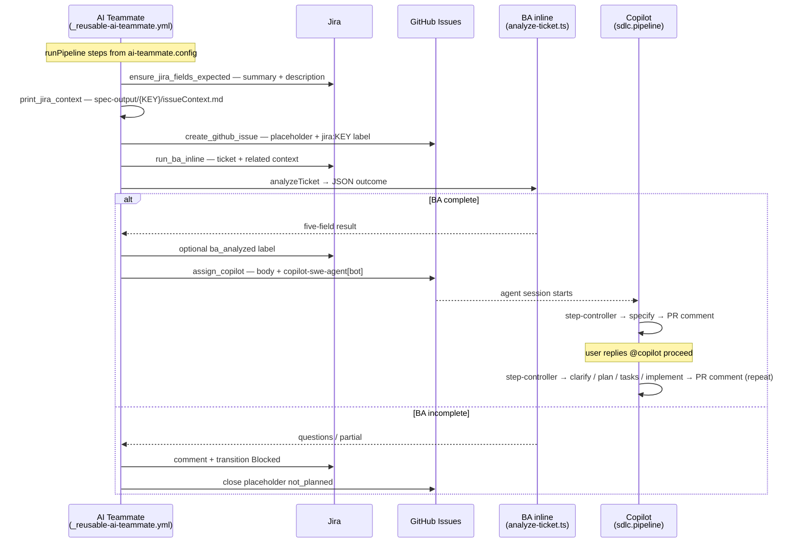
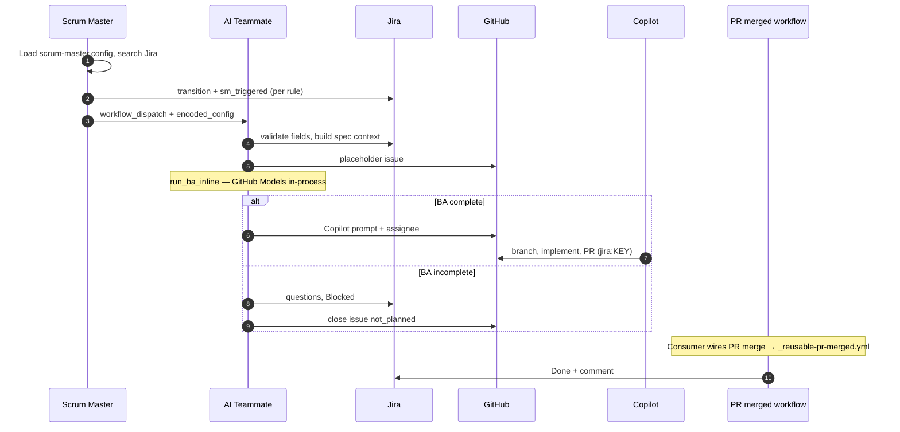
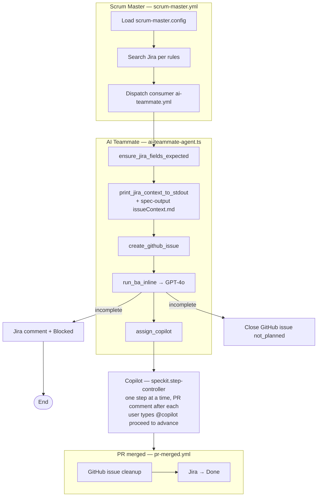

# SDLCAgents

## Open Questions / Concerns / TODO

| Priority | # | Topic | Description |
|----------|---|-------|-------------|
| ✅ Done | 1 | **Human-in-the-loop option** | Each speckit step now runs independently. After every step the agent posts a PR comment with a summary; the user types `@copilot proceed` to advance to the next step. State is tracked in `speckit-state.json` in the feature directory. |
| 🔴 Critical | 2 | **More complex prompts** | Invest in richer, more detailed prompts for each agent step — better context injection, chain-of-thought guidance, domain-specific instructions, and example-driven few-shot patterns to improve output quality |
| 🔴 Critical | 3 | **Lock on GitHub flow** | Currently locked into the GitHub issue → PR → agent pattern. Explore running Codex or Claude binaries directly without requiring the GitHub issue/PR lifecycle |
| 🟠 High | 4 | **Lightweight pipeline (no spec-kit)** | For simpler tickets that don't need the full specify→clarify→plan→tasks→implement ceremony, support a lightweight mode that goes straight to implementation |
| 🟠 High | 5 | **Solve merge conflicts** | Automatically detect and resolve merge conflicts on Copilot branches — rebase against master, apply conflict resolution heuristics, and re-run tests before marking the PR as ready |
| 🟡 Medium | 6 | **More complex routing** | Smarter scrum master routing: route by ticket type, priority, team, component, or estimated complexity rather than simple label-based rules |
| 🟡 Medium | 7 | **Use different agents** | Support pluggable implementer agents — Claude Code, OpenAI Codex, GitHub Copilot — switchable via config without changing pipeline code |
| 🟡 Medium | 8 | **Choose different AI models** | Allow per-step or per-workflow model selection (e.g. GPT-4o for BA analysis, Claude for implementation, smaller/cheaper models for low-stakes steps) |
| 🟢 Low | 9 | **More agents** | Expand the agent roster: security reviewer, performance profiler, documentation generator, test coverage enforcer, dependency auditor |
| 🟢 Low | 10 | **More sources than just Jira** | Support additional ticket sources: GitHub Issues native, Azure DevOps, Linear, Shortcut — with a pluggable source adapter interface |
| 🟡 Medium | 11 | **AI skills and MCP servers** | Equip agents with reusable skills (e.g. run tests, query docs, search codebase) and expose pipeline capabilities as MCP servers so any MCP-compatible client can trigger or extend the SDLC workflow |

---

## Consumer Repo Setup Checklist

### Automated (recommended)

An onboarding workflow copies all required files in a single run:

1. Add a `COPILOT_PAT` secret to the new repo (Classic PAT — see scopes below).
2. Copy [`.github/consumer-templates/onboarding.yml`](.github/consumer-templates/onboarding.yml) to `.github/workflows/onboarding.yml` in the new repo.
3. Go to **Actions → SDLC Onboarding → Run workflow**, enter your Jira project key, and click **Run**.
4. The workflow commits all required files with the correct project key substituted.

### Manual checklist

If you prefer to copy files manually, ensure all of the following are in place:

| # | What | Where | Notes |
|---|------|-------|-------|
| 1 | `COPILOT_PAT` secret | Repo → Settings → Secrets | Classic PAT — see scopes below |
| 2 | `.github/workflows/copilot-setup-steps.yml` | Must install `powershell` | Spec-kit scripts use `pwsh` — missing this means spec artifacts are never written to disk |
| 3 | `.specify/` directory | Repo root | Spec-kit CLI scaffolding — copy from a reference repo or run `specify init --here` |
| 4 | `.github/agents/` | All `speckit.*.agent.md` files | Copilot sub-agent definitions |
| 5 | `.github/prompts/` | All `speckit.*.prompt.md` files | Prompt templates |
| 6 | `config/spec-kit/constitution.md` | Repo root | Project-specific guidelines for the BA and spec agents |
| 7 | `config/spec-kit/defaults.json` | Repo root | Global directive and defaults |
| 8 | `config/workflows/` | `ai-teammate/`, `scrum-master/` configs | Update Jira project key in JQL |

> **PowerShell note:** `copilot-setup-steps.yml` must include an `Install PowerShell` step (`sudo apt-get install -y powershell`). Without it, the spec-kit scripts silently fail and no spec artifacts (`specs/<branch>/`) are committed during the pipeline run.

---

## GitHub Secrets — Required PAT

The workflows require a **GitHub Classic PAT** stored as the `COPILOT_PAT` repository secret.

> Fine-grained PATs are **not supported** — GitHub does not allow cross-repository `workflow_dispatch` triggers with fine-grained tokens.

| Scope | Why it is needed |
|-------|-----------------|
| `repo` | Read/write issues, labels; trigger `workflow_dispatch` within the repo |
| `workflow` | Trigger `workflow_dispatch` events on GitHub Actions workflows |
| `read:org` | Verify that `copilot-swe-agent[bot]` is a valid assignee within the organisation |

`write:org` is **not** required — assigning the bot to an issue is a repo-level write operation covered by `repo`, not an org-level mutation.

---

## AI Teammate — Issue & Agent Flow

This matches the TypeScript pipeline in `src/workflows/ai-teammate/` (see `docs/pipeline-flow.md`). BA runs **inline** in the `run_ba_inline` step (GitHub Models / GPT-4o), not via a separate workflow or sub-issue.

---

## Sequential Flow

---

## Pipeline Flow (flowchart)

