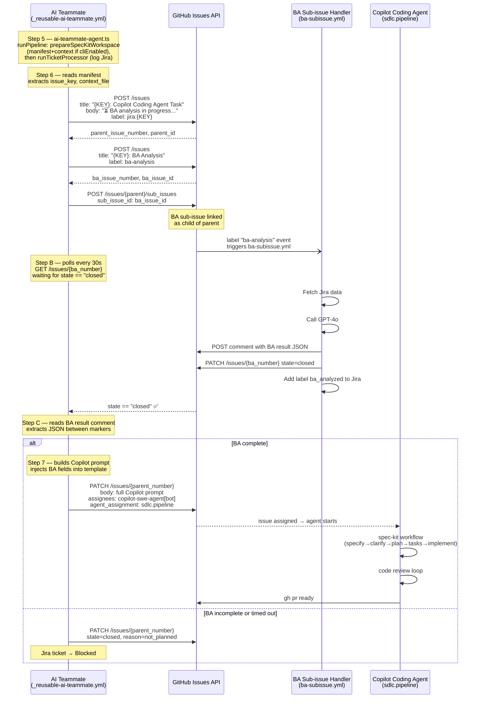
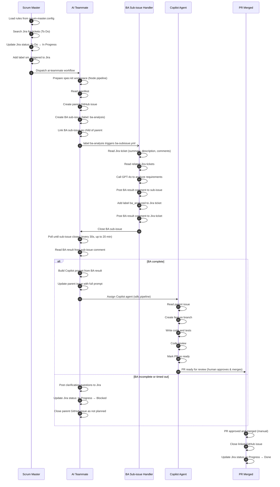

# SDLCAgents

## Open Questions / Concerns / TODO

| Priority | # | Topic | Description |
|----------|---|-------|-------------|
| 🔴 Critical | 1 | **Human-in-the-loop option** | Answer questions from the model if any, and add an optional approval gate before implementation starts — post a summary comment on the PR/issue and wait for explicit approval before the Copilot agent proceeds |
| 🔴 Critical | 2 | **More complex prompts** | Invest in richer, more detailed prompts for each agent step — better context injection, chain-of-thought guidance, domain-specific instructions, and example-driven few-shot patterns to improve output quality |
| 🔴 Critical | 3 | **Lock on GitHub** | Prevent concurrent Copilot agent runs on the same issue/branch (GitHub concurrency groups help but need a more robust distributed lock strategy) |
| 🟠 High | 4 | **Lightweight pipeline (no spec-kit)** | For simpler tickets that don't need the full specify→clarify→plan→tasks→implement ceremony, support a lightweight mode that goes straight to implementation |
| 🟠 High | 5 | **Solve merge conflicts** | Automatically detect and resolve merge conflicts on Copilot branches — rebase against master, apply conflict resolution heuristics, and re-run tests before marking the PR as ready |
| 🟡 Medium | 6 | **More complex routing** | Smarter scrum master routing: route by ticket type, priority, team, component, or estimated complexity rather than simple label-based rules |
| 🟡 Medium | 7 | **Use different agents** | Support pluggable implementer agents — Claude Code, OpenAI Codex, GitHub Copilot — switchable via config without changing pipeline code |
| 🟡 Medium | 8 | **Choose different AI models** | Allow per-step or per-workflow model selection (e.g. GPT-4o for BA analysis, Claude for implementation, smaller/cheaper models for low-stakes steps) |
| 🟢 Low | 9 | **More agents** | Expand the agent roster: security reviewer, performance profiler, documentation generator, test coverage enforcer, dependency auditor |
| 🟢 Low | 10 | **More sources than just Jira** | Support additional ticket sources: GitHub Issues native, Azure DevOps, Linear, Shortcut — with a pluggable source adapter interface |

---

## Consumer Repo Setup Checklist

When onboarding a new repository to use the SDLC pipeline, ensure the following are in place:

| # | What | Where | Notes |
|---|------|-------|-------|
| 1 | `COPILOT_PAT` secret | Repo → Settings → Secrets | Classic PAT — see scopes below |
| 2 | `.github/workflows/copilot-setup-steps.yml` | Must install `powershell` | Spec-kit scripts use `pwsh` — missing this means spec artifacts are never written to disk |
| 3 | `.specify/` directory | Repo root | Spec-kit CLI scaffolding — copy from a reference repo or run `specify init --here` |
| 4 | `.github/agents/` | All `speckit.*.agent.md` files | Copilot sub-agent definitions |
| 5 | `.github/prompts/` | All `speckit.*.prompt.md` files | Prompt templates |
| 6 | `config/spec-kit/constitution.md` | Repo root | Project-specific guidelines for the BA and spec agents |
| 7 | `config/spec-kit/defaults.json` | Repo root | Global directive and defaults |
| 8 | `config/workflows/` | `ai-teammate/`, `business-analyst/`, `scrum-master/` configs | Update Jira project key in JQL |

> **PowerShell note:** `copilot-setup-steps.yml` must include an `Install PowerShell` step (`sudo apt-get install -y powershell`). Without it, the spec-kit scripts silently fail and no spec artifacts (`specs/<branch>/`) are committed during the pipeline run.

---

## GitHub Secrets — Required PAT

The workflows require a **GitHub Classic PAT** stored as the `COPILOT_PAT` repository secret.

> Fine-grained PATs are **not supported** — GitHub does not allow cross-repository `workflow_dispatch` triggers with fine-grained tokens.

| Scope | Why it is needed |
|-------|-----------------|
| `repo` | Read/write issues, labels; trigger `workflow_dispatch` within the repo |
| `workflow` | Trigger `workflow_dispatch` events on GitHub Actions workflows |
| `read:org` | Verify that `copilot-swe-agent[bot]` is a valid assignee within the organisation |

`write:org` is **not** required — assigning the bot to an issue is a repo-level write operation covered by `repo`, not an org-level mutation.

---

## AI Teammate — Issue & Agent Flow

---

## Sequential Flow

---

## Pipeline Flow (flowchart)

```mermaid
flowchart TD
    %% ── Scrum Master ──────────────────────────────────────────────
    subgraph SM [" 🔁  Scrum Master — scrum-master.yml"]
        SM1[Load rules from scrum-master.config]
        SM2[Search Jira for tickets\nwith status 'To Do']
        SM3[Update Jira status:\nTo Do → In Progress]
        SM4[Add label 'sm_triggered'\nto Jira ticket]
        SM5[Dispatch ai-teammate workflow]
        SM1 --> SM2 --> SM3 --> SM4 --> SM5
    end

    %% ── AI Teammate — pre-BA ──────────────────────────────────────
    subgraph AT_PRE [" 🤖  AI Teammate — ai-teammate.yml (Steps 5, 6, A)"]
        AT2[prepareSpecKitWorkspace +\nrunTicketProcessor]
        AT3[Read manifest:\nissue key, context file]
        AT4[Create GitHub issue:\nparent placeholder]
        AT5[Create GitHub sub-issue:\nBA Analysis]
        AT6[Link BA sub-issue\nas child of parent]
        AT2 --> AT3 --> AT4 --> AT5 --> AT6
    end

    SM5 --> AT2

    %% ── BA Sub-issue Handler ──────────────────────────────────────
    subgraph BA [" 🔍  BA Sub-issue Handler — ba-subissue.yml"]
        BA2[Read Jira ticket:\nsummary, description, comments]
        BA3[Read related Jira tickets]
        BA4[Call GPT-4o to analyze\nticket requirements]
        BA5[Post BA result comment\nto sub-issue]
        BA6[Close BA sub-issue]
        BA2 --> BA3 --> BA4 --> BA5 --> BA6
    end

    AT6 -- "label 'ba-analysis'\ntriggers ba-subissue.yml" --> BA2

    %% ── AI Teammate — poll & route ────────────────────────────────
    subgraph AT_POLL [" 🤖  AI Teammate — Steps B, C"]
        POLL[Poll BA sub-issue state every 30s\nuntil closed or 20 min timeout]
        READ[Read BA result from\nsub-issue comment]
        ROUTE{BA result?}
        POLL --> READ --> ROUTE
    end

    BA6 --> POLL

    %% ── Incomplete path ───────────────────────────────────────────
    subgraph BLOCKED [" 🚫  Blocked"]
        BLOCK1[Add clarification questions\nas Jira comment]
        BLOCK2[Update Jira status:\nIn Progress → Blocked]
        BLOCK3[Add label 'ba_analyzed'\nto Jira ticket]
        BLOCK4[Close parent GitHub issue\nas not planned]
        END_BLOCK([End])
        BLOCK1 --> BLOCK2 --> BLOCK3 --> BLOCK4 --> END_BLOCK
    end

    ROUTE -- "BA incomplete\nor timed out" --> BLOCK1

    %% ── AI Teammate — post-BA ─────────────────────────────────────
    subgraph AT_POST [" 🤖  AI Teammate resumed — Steps 7, 8"]
        AT8[Build Copilot prompt\nfrom BA result]
        AT9[Update parent GitHub issue\nwith full Copilot prompt]
        AT10[Assign Copilot coding agent\nsdlc.pipeline]
        AT8 --> AT9 --> AT10
    end

    ROUTE -- "BA complete" --> AT8

    %% ── Copilot Coding Agent ──────────────────────────────────────
    subgraph COP [" 💻  Copilot Coding Agent — sdlc.pipeline.agent.md"]
        COP2[Read parent issue\nspecify → clarify → plan → tasks → implement]
        COP3[Create feature branch]
        COP4[Write code and tests]
        COP5[Code review]
        COP6[Open draft PR]
        COP2 --> COP3 --> COP4 --> COP5 --> COP6
    end

    AT10 --> COP2

    %% ── Mark PR Ready ─────────────────────────────────────────────
    subgraph MR [" ✅  PR Merged — pr-merged.yml"]
        MR2[Close parent GitHub issue]
        MR3[Update Jira status:\nIn Progress → Done]
        END_OK([End])
        MR2 --> MR3 --> END_OK
    end

    COP6 --> MR2

    %% ── Subgraph styles ───────────────────────────────────────────
    style SM       fill:#e8f5e9,stroke:#43a047,color:#1b5e20
    style AT_PRE   fill:#e3f2fd,stroke:#1e88e5,color:#0d47a1
    style BA       fill:#f3e5f5,stroke:#8e24aa,color:#4a148c
    style AT_POLL  fill:#e3f2fd,stroke:#1e88e5,color:#0d47a1
    style BLOCKED  fill:#fce4ec,stroke:#e53935,color:#b71c1c
    style AT_POST  fill:#e3f2fd,stroke:#1e88e5,color:#0d47a1
    style COP      fill:#e0f7fa,stroke:#00acc1,color:#006064
    style MR       fill:#e8f5e9,stroke:#43a047,color:#1b5e20

    %% ── Node styles ───────────────────────────────────────────────
    classDef action fill:#fff,stroke:#90a4ae,color:#263238
    classDef decision fill:#fff8e1,stroke:#f9a825,color:#33691e
    classDef terminal fill:#ef9a9a,stroke:#e53935,color:#b71c1c,font-weight:bold

    class SM1,SM2,SM3,SM4,SM5,AT2,AT3,AT4,AT5,AT6,BA2,BA3,BA4,BA5,BA6,POLL,READ,AT8,AT9,AT10,COP2,COP3,COP4,COP5,COP6,MR2,MR3,BLOCK1,BLOCK2,BLOCK3,BLOCK4 action
    class ROUTE decision
    class END_BLOCK,END_OK terminal
```

