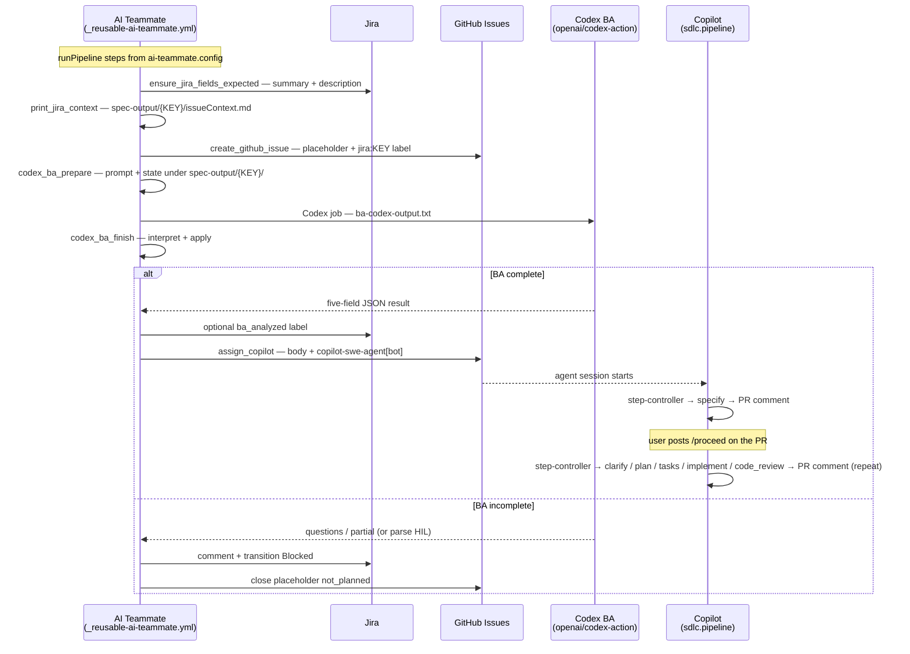
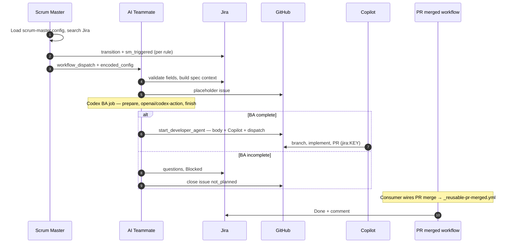

# SDLCAgents

## Open Questions / Concerns / TODO

| Priority | # | Topic | Description |
|----------|---|-------|-------------|
| ✅ Done | 1 | **Human-in-the-loop option** | Each speckit step now runs independently. After every step the agent posts a PR comment with a summary; the user posts a PR comment starting with `/proceed` to advance to the next step. State is tracked in `speckit-state.json` in the feature directory. |
| 🔴 Critical | 2 | **More complex prompts** | Improve per-step prompt quality with structured context injection, explicit acceptance criteria, failure modes, and example-driven patterns (few-shot) to improve output quality |
| 🔴 Critical | 3 | **Lock on GitHub flow** | Production runs are currently locked into the GitHub issue → PR → workflow pattern. Add an alternate entrypoint to run the same pipeline without requiring the issue/PR lifecycle |
| 🟠 High | 4 | **Lightweight pipeline (no spec-kit)** | For simpler tickets that don't need the full specify→clarify→plan→tasks→implement ceremony, support a lightweight mode that goes straight to implementation (and still runs gate/validation) |
| 🟠 High | 5 | **Solve merge conflicts** | Make conflict handling reliable: detect conflicts early, auto-rebase branches, (optionally) apply safe resolution heuristics, then re-run validation before marking the PR ready |
| 🟡 Medium | 6 | **More complex routing** | Smarter Scrum Master (Jira) routing: route by ticket type, priority, team, component, or estimated complexity rather than simple label-based rules |
| 🟡 Medium | 7 | **Use different agents** | Support pluggable implementer agents (e.g. OpenAI Codex, Claude Code, GitHub Copilot) via config — keep a stable “prompt + sandbox + outputs” contract across runners |
| 🟡 Medium | 8 | **Choose different AI models** | Allow per-step or per-workflow model selection (some workflow-level knobs already exist via repo variables); define a consistent override mechanism across workflows |
| 🟢 Low | 9 | **More agents** | Expand the agent roster: security reviewer, performance profiler, documentation generator, test coverage enforcer, dependency auditor |
| 🟢 Low | 10 | **More sources than just Jira** | Support additional ticket sources: GitHub Issues native, Azure DevOps, Linear, Shortcut — with a pluggable source adapter interface |
| 🟡 Medium | 11 | **AI skills and MCP servers** | Equip agents with reusable skills (e.g. run tests, query docs, search codebase) and expose pipeline capabilities as MCP servers so any MCP-compatible client can trigger or extend the SDLC workflow |

---

## Consumer Repo Setup Checklist

### Automated (recommended)

An onboarding workflow copies all required files in a single run:

1. Add a `COPILOT_PAT` secret to the new repo (Classic PAT — see scopes below).
2. Copy [`.github/consumer-templates/onboarding.yml`](.github/consumer-templates/onboarding.yml) to `.github/workflows/onboarding.yml` in the new repo.
3. Go to **Actions → SDLC Onboarding → Run workflow**, enter your Jira project key, and click **Run**.
4. The workflow commits all required files with the correct project key substituted.

### Manual checklist

If you prefer to copy files manually, ensure all of the following are in place:

| # | What | Where | Notes |
|---|------|-------|-------|
| 1 | `COPILOT_PAT` secret | Repo → Settings → Secrets | Classic PAT — see scopes below |
| 2 | `.github/workflows/copilot-setup-steps.yml` | Must install `powershell` | Spec-kit scripts use `pwsh` — missing this means spec artifacts are never written to disk |
| 3 | `.specify/` directory | Repo root | Spec-kit CLI scaffolding — copy from a reference repo or run `specify init --here` |
| 4 | `.github/agents/` | e.g. `sdlc.pipeline.agent.md`, `code.review.agent.md` | SDLC / Copilot orchestration (not the optional upstream `speckit.*.agent.md` set when using Codex-only skills) |
| 5 | `.agents/skills/speckit-*/` | `SKILL.md` per step | **Codex** spec-kit steps — installed by onboarding from this repo |
| 6 | `config/spec-kit/constitution.md` | Repo root | Project-specific guidelines for the BA and spec agents |
| 7 | `config/spec-kit/defaults.json` | Repo root | Global directive and defaults |
| 8 | `config/workflows/` | `ai-teammate/`, `scrum-master/` configs | Update Jira project key in JQL |

> **PowerShell note:** `copilot-setup-steps.yml` must include an `Install PowerShell` step (`sudo apt-get install -y powershell`). Without it, the spec-kit scripts silently fail and no spec artifacts (`specs/<branch>/`) are committed during the pipeline run.

---

## Spec Gate — Automatic LLM Review

After each speckit step, the **Spec Gate** workflow (`spec-gate.yml`) reviews the produced artifacts with **OpenAI Codex** (`openai/codex-action@v1` in the reusable workflow) and either advances the pipeline or flags it for human attention.

### How it works

1. Triggered when `speckit-state.json` is pushed to a `feature/**`, `spec/**`, or `copilot/**` branch
2. Waits for the Copilot session to finish (polls the `copilot` check run)
3. Reads the step's artifacts (e.g. `spec.md`, `plan.md`, `tasks.md`)
4. Runs Codex on a composed prompt to detect open issues: `NEEDS CLARIFICATION`, `Open Questions`, `TBD`, unchecked checklist items, etc.
5. Posts a PR comment and, when clean, **workflow_dispatch**es **Developer Agent — Proceed** (bot comments alone do not trigger `issue_comment` workflows).
6. After **`implement`**, the next automated step is **`code_review`** (Codex skill `speckit-code_review`). The **`code_review`** gate expects a **human merge** after review artifacts are on the branch.

> **HIL** — if the gate finds blockers, fix artifacts (or code) and use **`/proceed`** (or your PR Comment Handler routing) to continue.

### Optional configuration

| Repo variable | Default | Description |
|---------------|---------|-------------|
| `GATE_CODEX_MODEL` | _(workflow default `o4-mini`)_ | Codex model for spec gate analysis |

### Responding to HIL

1. Read the issues table in the PR comment
2. Fix the flagged items in the spec artifacts (edit the files directly or reply to Copilot)
3. Comment **`/proceed`** on the PR (or use your PR Comment Handler) to re-trigger the next step

---

## GitHub Secrets — Required PAT

The workflows require a **GitHub Classic PAT** stored as the `COPILOT_PAT` repository secret.

Repositories that run **Spec Gate** or **AI Teammate / Developer Agent** with Codex also need an **`OPENAI_API_KEY`** secret (standard OpenAI API key for `openai/codex-action@v1`).

> Fine-grained PATs are **not supported** — GitHub does not allow cross-repository `workflow_dispatch` triggers with fine-grained tokens.

| Scope | Why it is needed |
|-------|-----------------|
| `repo` | Read/write issues, labels; trigger `workflow_dispatch` within the repo |
| `workflow` | Trigger `workflow_dispatch` events on GitHub Actions workflows |
| `read:org` | Verify that `copilot-swe-agent[bot]` is a valid assignee within the organisation |

`write:org` is **not** required — assigning the bot to an issue is a repo-level write operation covered by `repo`, not an org-level mutation.

---

## AI Teammate — Issue & Agent Flow

This matches the TypeScript pipeline in `src/workflows/ai-teammate/` (see `docs/pipeline-flow.md`). BA always runs via **`openai/codex-action@v1`** (`AI_TEAMMATE_MODE=codex_ba_prepare` / `codex_ba_finish`). For a dry run, use `npm run ai-teammate:debug` (prepare only, mocked deps).



---

## Sequential Flow



---

## Pipeline Flow (flowchart)

```mermaid
flowchart TD
    subgraph SM [Scrum Master — scrum-master.yml]
        SM1[Load scrum-master.config]
        SM2[Search Jira per rules]
        SM3[Dispatch consumer ai-teammate.yml]
        SM1 --> SM2 --> SM3
    end

    subgraph AT [AI Teammate — reusable workflow + agent]
        A1[ensure_jira_fields_expected]
        A2[print_jira_context_to_stdout\n+ spec-output issueContext.md]
        A3[create_github_issue]
        A4[Codex BA — openai/codex-action\n(config step run_ba_inline)]
        A5[start_developer_agent]
        A1 --> A2 --> A3 --> A4 --> A5
    end

    SM3 --> A1

    A4 -->|incomplete| X1[Jira comment + Blocked]
    A4 -->|incomplete| X2[Close GitHub issue not_planned]
    X1 --> END_BAD([End])

    A5 --> COP[Copilot — speckit.step-controller\none step at a time, PR comment after each\nuser posts /proceed to advance]

    subgraph PM [PR merged — pr-merged.yml]
        P1[GitHub issue cleanup]
        P2[Jira → Done]
        P1 --> P2
    end

    COP --> PM
```
